<div align="center">

# ⚡ SANJANA M ⚡

[](https://git.io/typing-svg)


</div>

<br>

## 🌐 SYSTEM PROFILE


```yaml
user:
  name: "Sanjana M"
  role: "AI/ML Engineer"
  location: "Bangalore, India 🇮🇳"
  education: "B.E in AI & Data Science [9.1 CGPA]"
  
specialization:
  - Generative AI
  - Large Language Models
  - RAG Systems
  - AI Agents
  
status: "Building production-ready AI systems"
mission: "Creating scalable solutions for real-world problems"
```

### 📡 TRANSMISSION CHANNELS

[](https://linkedin.com/in/sanjana-m--)
[](mailto:sanjanamahantesh@gmail.com)
[](https://sannnportfolio.netlify.app/)
[](https://github.com/Sanjana-m55)

<br clear="right"/>

---

## 🔮 TECHNOLOGY MATRIX

<div align="center">

### ▸ CORE SYSTEMS


### ▸ NEURAL FRAMEWORKS


### ▸ AI INTELLIGENCE LAYER


### ▸ WEB PROTOCOLS


### ▸ DATA PROCESSORS


### ▸ DATABASE NODES


### ▸ DEVELOPMENT TOOLS


</div>

---

## 🚀 DEPLOYED SYSTEMS

<div align="center">

### ╭━━━╮╭━━━╮╭━━━╮
### ┃ 01 ┃┃ 02 ┃┃ 03 ┃
### ╰━━━╯╰━━━╯╰━━━╯

</div>

<table>
<tr>
<td width="33%" valign="top">

### 🎯 DECISION LENS
**AI-Powered Enterprise Simulator**

```yaml
status: ✓ LIVE
type: GenAI Platform
```

Enterprise simulator combining market insights, NLP, and visual analytics for strategic decision-making.

**Stack:**
- 🦜 LangChain
- 🎨 Streamlit
- 🔍 FAISS
- 🔥 Firebase

[](https://github.com/Sanjana-m55/Decision-Lens)

</td>
<td width="33%" valign="top">

### ☀️ SOLAR ANALYSIS
**ML-Driven Performance Tool**

```yaml
status: ✓ LIVE
type: ML System
```

Advanced ML system for solar PV efficiency analysis with real-time diagnostics and performance optimization.

**Stack:**
- 💡 LightGBM
- 🚀 XGBoost
- 📊 Plotly
- 🎨 Streamlit

[](https://github.com/Sanjana-m55/Solar-Analysis)

</td>
<td width="33%" valign="top">

### 💰 MONEY MAP
**Personal Finance AI** 📝 *Published*

```yaml
status: ✓ LIVE
type: Research Project
```

AI-driven finance platform with automated insights, chatbot assistance, and personalized recommendations.

**Stack:**
- 🌐 Django
- 🤖 Google Gemini
- 📈 Scikit-Learn
- 💹 YFinance

[](https://github.com/Sanjana-m55/Money-Map)

</td>
</tr>
</table>

<div align="center">

```
━━━━━━━━━━━━━━━━━━━━━━━━━━━━━━━━━━━━━━━━━━━━━━━━━━━━━━━━━━━━━━━━━
  💡 MORE PROJECTS AVAILABLE ON GITHUB | ALWAYS BUILDING SOMETHING NEW
━━━━━━━━━━━━━━━━━━━━━━━━━━━━━━━━━━━━━━━━━━━━━━━━━━━━━━━━━━━━━━━━━
```

</div>

---

## 📊 SYSTEM METRICS

<div align="center">

<table>
<tr>

<td>

<div style="
  padding:18px;
  width:180px;
  border-radius:20px;
  background: rgba(255,255,255,0.05);
  border: 1px solid rgba(0,247,255,0.4);
  backdrop-filter: blur(8px);
  text-align:center;">
  
<h3 style="margin:5px 0; color:#fff;">🔥 Total Contributions</h3>
<p style="color:#00F7FF; font-size:22px; font-weight:600;">107</p>

</div>

</td>

<td>

<div style="
  padding:18px;
  width:180px;
  border-radius:20px;
  background: rgba(255,255,255,0.05);
  border: 1px solid rgba(0,247,255,0.4);
  backdrop-filter: blur(8px);
  text-align:center;">
  
<h3 style="margin:5px 0; color:#fff;">🔥 Current Streak</h3>
<p style="color:#00F7FF; font-size:22px; font-weight:600;">1 Day</p>

</div>

</td>

<td>

<div style="
  padding:18px;
  width:180px;
  border-radius:20px;
  background: rgba(255,255,255,0.05);
  border: 1px solid rgba(0,247,255,0.4);
  backdrop-filter: blur(8px);
  text-align:center;">
  
<h3 style="margin:5px 0; color:#fff;">🔥 Longest Streak</h3>
<p style="color:#00F7FF; font-size:22px; font-weight:600;">3 Days</p>

</div>

</td>

</tr>
</table>

</div>


## 🎯 CONTRIBUTION ANALYTICS

<div align="center">

[](https://github.com/ashutosh00710/github-readme-activity-graph)

</div>

---

## 🏆 GITHUB TROPHIES

<div align="center">

[](https://github.com/ryo-ma/github-profile-trophy)

</div>

---

## 🐍 CONTRIBUTION SNAKE

<div align="center">

<picture>
  <source media="(prefers-color-scheme: dark)" srcset="https://raw.githubusercontent.com/Sanjana-m55/Sanjana-m55/output/github-contribution-grid-snake-dark.svg">
  <source media="(prefers-color-scheme: light)" srcset="https://raw.githubusercontent.com/Sanjana-m55/Sanjana-m55/output/github-contribution-grid-snake.svg">
  
</picture>

</div>

---

## 🎓 CREDENTIALS & ACHIEVEMENTS

<div align="center">

```diff
@@ HACKATHONS & COMPETITIONS @@
+ 🏆 WINNER     → Zelestra X AWS ML Ascend Challenge 2025
+ 🥈 FINALIST   → ATEMCS Global Hackathon (Semi-Finalist)
+ 🥉 RUNNER-UP  → Inter-College Hackathon, SVIT College

@@ RESEARCH & PUBLICATIONS @@
+ 📝 PUBLISHED  → IOSR Journal of Computer Engineering (Vol. 27, Issue 2)
+ 📊 CITATION   → AI-Driven Personal Finance Management System

@@ PROFESSIONAL EXPERIENCE @@
+ 💼 ML INTERN  → Orinson Technologies (92% Model Accuracy)
+ 🎯 CERTIFIED  → Machine Learning Specialization
+ 🔬 RESEARCH   → Focus on RAG Systems & AI Agents

@@ OPEN SOURCE @@
+ 🌟 ACTIVE     → Open-Source Contributor
+ 🎃 2024       → Hacktoberfest Participant
+ 💚 2025       → GSSoC Extended Contributor
```

</div>

---

## 💼 PROFESSIONAL TIMELINE

```mermaid
timeline
    title Career Timeline
    2025 : Winner – Zelestra X AWS Challenge
         : Finalist – ATEMCS Hackathon
         : GSSoC Extended Contributor
         : RAG & Agent Projects
         : Hacktoberfest Contributor
    2024 : Research Published (IOSR)
         : ML Intern – Orinson Technologies
         : Inter-College Hackathon Runner-Up
    2023 : B.E in AI & Data Science
         : ML & Deep Learning Foundation
         : First Production AI Systems

```



</div>

---

## 📫 CONNECT WITH ME

<div align="center">

### Let's Build Something Amazing Together! 🚀

[](https://linkedin.com/in/sanjana-m--)
[](mailto:sanjanamahantesh@gmail.com)
[](https://sannnportfolio.netlify.app/)
[](https://github.com/Sanjana-m55)

<br>

[](https://git.io/typing-svg)

<br>


</div>

---

<div align="center">

### 💭 Random Dev Quote


</div>

---

<div align="center">

```
╔═══════════════════════════════════════════════════════════╗
║                                                           ║
║  >> SYSTEM STATUS        : ONLINE                         ║
║  >> CURRENT MODE         : INNOVATION & DEVELOPMENT       ║
║  >> ACTIVE PROJECTS      : 17+                            ║
║  >> FOCUS AREAS          : RAG | AI AGENTS | LLMs         ║
║  >> COLLABORATION STATUS : OPEN                           ║
║                                                           ║
╚═══════════════════════════════════════════════════════════╝
```

### ⭐ Star my repositories if you find them useful!


</div>


